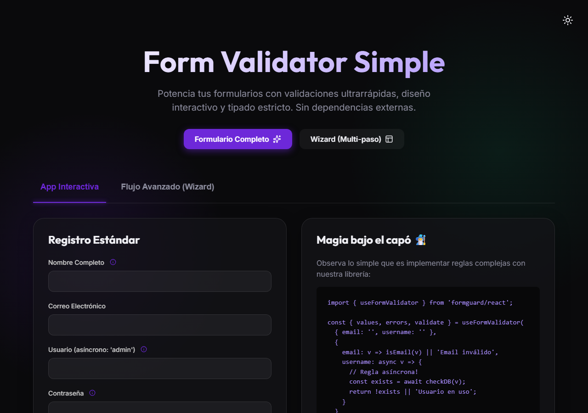
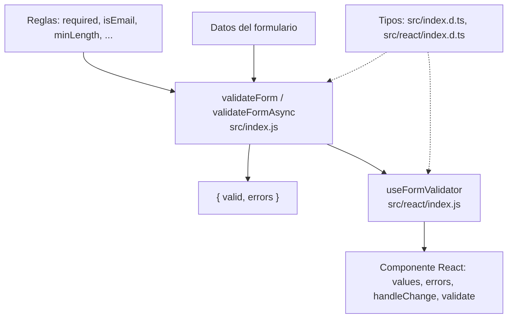

<div align="center">
  
  <h1>FormGuard</h1>
  <p><b>Validación de formularios sin dependencias para JavaScript/TypeScript, con un hook opcional para React.</b></p>
  
  
  
  
  
  <a href="https://github.com/Luiss2080/FormGuard/actions/workflows/ci.yml"></a>
  <p>
    <a href="#-inicio-rápido">Inicio rápido</a> ·
    <a href="#-características">Características</a> ·
    <a href="#-arquitectura">Arquitectura</a> ·
    <a href="#-pruebas">Pruebas</a> ·
    <a href="#-lo-que-todavía-no-existe">Limitaciones</a>
  </p>
</div>

FormGuard (antes `form-validator-simple`) es una librería de **reglas de validación como funciones
puras** más `validateForm` / `validateFormAsync` para aplicarlas a un objeto de datos, y un hook
`useFormValidator` para React. **No** es un framework de formularios: no renderiza campos, no
maneja `touched`/`dirty` ni validaciones de objetos anidados.

## 🎬 Vista rápida

Captura de la app de demostración incluida en `demo/` (React + Vite), corrida en local:

<div align="center">
  
</div>

## ✨ Características

| Característica | Detalle |
|---|---|
| Sin dependencias | `package.json` no declara `dependencies`; React se importa solo desde `formguard/react`. |
| Reglas de texto y número | `required`, `isEmail`, `minLength`, `maxLength`, `match`, `pattern`, `isNumeric`, `min`, `max`, `isAlphanumeric`, `isStrongPassword`. |
| Formatos | `isUrl`, `isDate` (`YYYY-MM-DD` real), `isCreditCard` (Luhn), `isUUID`, `isIP` (v4 y v6 completo), `isHexColor`, `isJSON`, `isPhoneBolivia` (8 dígitos, empieza en 6 o 7, acepta `+591`). |
| Archivos | `maxFileSize(file, mb)` y `allowedFileTypes(file, tipos)`, esta última compara `file.type` declarado, no inspecciona el contenido. |
| Formulario completo | `validateForm(data, rules, { allErrors })`: primer error por campo, o todos si `allErrors: true`. |
| Asíncrono | `validateFormAsync` espera reglas que devuelven promesas. |
| React | `useFormValidator(initial, rules)` devuelve `values`, `errors`, `handleChange`, `validate`, `isValid`, `isSubmitting`. |
| Tipos | `src/index.d.ts` y `src/react/index.d.ts`. |

## 🏗️ Arquitectura



## 🚀 Inicio rápido

| Requisito | Versión |
|---|---|
| Node.js | 18 o superior |
| React (solo para el hook) | Cualquiera con hooks; el demo usa React 19 |

**Este paquete no está publicado en npm** (`npm view formguard` responde 404), así que `npm install formguard` no funciona. Úsalo desde el repositorio:

```bash
git clone https://github.com/Luiss2080/FormGuard.git
cd FormGuard
npm test
```

```js
import { validateForm, isEmail, required, minLength } from './src/index.js';

const rules = {
  username: [
    v => required(v) || 'El usuario es obligatorio',
    v => minLength(v, 5) || 'Mínimo 5 caracteres',
  ],
  email: v => isEmail(v) || 'El email no tiene un formato válido',
};

const { valid, errors } = validateForm({ username: 'luis', email: 'luis@invalido' }, rules, { allErrors: true });
// valid: false
// errors: { username: ['Mínimo 5 caracteres'], email: ['El email no tiene un formato válido'] }
```

Una regla devuelve `true` si el valor es válido o un mensaje de texto si no lo es.

<details>
<summary>Hook de React</summary>

```jsx
import { useFormValidator } from 'formguard/react';
import { isEmail } from 'formguard';

function Formulario() {
  const { values, errors, handleChange, validate, isSubmitting } = useFormValidator(
    { email: '' },
    { email: v => isEmail(v) || 'Email inválido' },
  );

  const onSubmit = async (e) => {
    e.preventDefault();
    if (await validate()) console.log('ok', values);
  };

  return (
    <form onSubmit={onSubmit}>
      <input value={values.email} onChange={e => handleChange('email', e.target.value)} />
      {errors.email && <span>{errors.email}</span>}
      <button disabled={isSubmitting}>Enviar</button>
    </form>
  );
}
```

`validate()` valida en modo **síncrono** por defecto. Si alguna regla es asíncrona, llama `validate(true)`.
El hook limpia el error de un campo al llamarse `handleChange` sobre él.

</details>

<details>
<summary>Reglas asíncronas</summary>

```js
import { validateFormAsync, required } from './src/index.js';

const rules = {
  username: async (v) => {
    if (!required(v)) return 'Requerido';
    const existe = await fetch(`/api/users/${v}`).then(r => r.json());
    return !existe || 'Ese nombre de usuario ya está tomado';
  },
};

const { valid, errors } = await validateFormAsync({ username: 'admin' }, rules);
```

</details>

<details>
<summary>Campos opcionales y accesibilidad</summary>

Los validadores de formato rechazan valores vacíos (`isEmail('')` es `false`). Para un campo opcional:

```js
sitioWeb: v => !required(v) || isUrl(v) || 'URL inválida'
```

`required` trata `0` y `false` como valores presentes; vacíos son `null`, `undefined`, texto en blanco y arrays vacíos.
La librería solo calcula validez; [`examples/accessible-form.html`](./examples/accessible-form.html) muestra cómo enlazarla con
`aria-invalid`, `aria-describedby` y `role="alert"` en HTML puro.

</details>

<details>
<summary>Estructura de carpetas</summary>

```text
src/index.js, src/index.d.ts          # reglas y validateForm / validateFormAsync
src/react/index.js, index.d.ts         # hook useFormValidator
test/index.test.js                     # pruebas node:test
demo/                                  # app React + Vite de demostración
examples/accessible-form.html          # ejemplo accesible sin framework
spec.md                                # especificación (SDD)
.github/workflows/ci.yml               # CI en Node 18, 20 y 22
```

</details>

Para ver la demo: `cd demo && npm ci && npx vite`.

## 🧪 Pruebas

```bash
npm test
```

Ejecutan **28 pruebas** (`node:test`) sobre reglas, `validateForm` y `validateFormAsync`; todas pasan. El workflow de CI corre `npm test` en Node 18, 20 y 22. El hook de React y la demo no tienen pruebas dentro de esa suite.

## 🚧 Lo que todavía no existe

- No está publicado en npm; el badge y las instrucciones de `npm install formguard` de la versión anterior no eran ciertos.
- `demo/src/App.test.jsx` **no funciona hoy**: `npx vitest run` en `demo/` falla con `Failed to resolve import "react" from "../src/react/index.js"`.
- La demo aún muestra el título "Form Validator Simple" (nombre anterior).
- `allowedFileTypes` confía en `file.type` que declara el navegador; no verifica el contenido real.
- `isEmail`, `isUrl` y `isStrongPassword` son expresiones regulares simples (la contraseña fuerte exige uno de `@$!%*?&` y solo admite esos símbolos); no sustituyen una validación en servidor.
- Sin validación de objetos anidados ni mensajes internacionalizados.
- El README anterior decía que `validate()` del hook revisa la asincronía automáticamente; en el código hay que pasar `true`.

## 📄 Licencia

MIT — ver [LICENSE](./LICENSE).

<div align="center"><sub>Hecho por Luiss2080 · Diseñado con Spec-Driven Development (ver <code>spec.md</code>)</sub></div>
